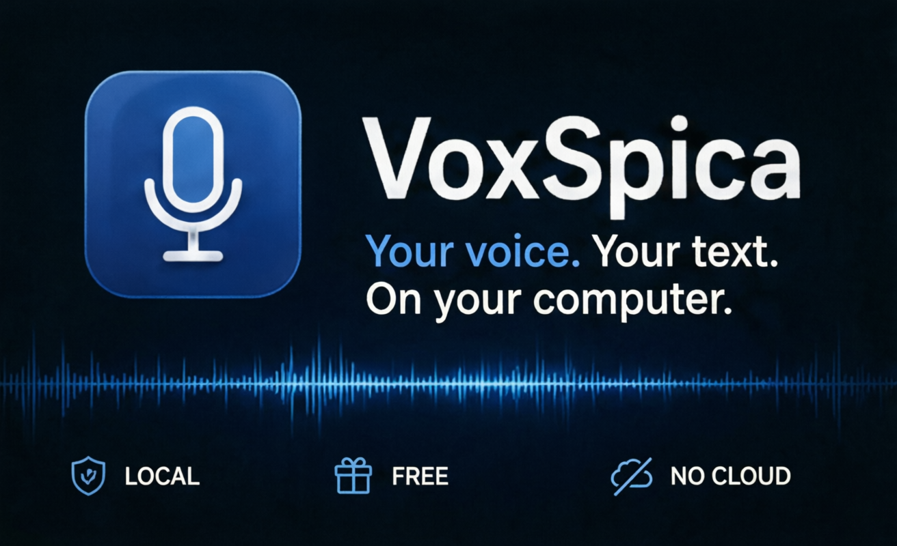
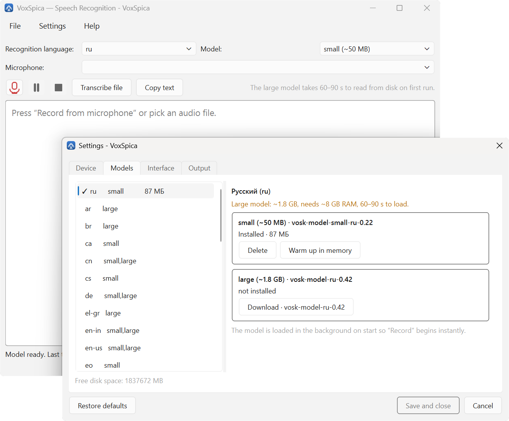
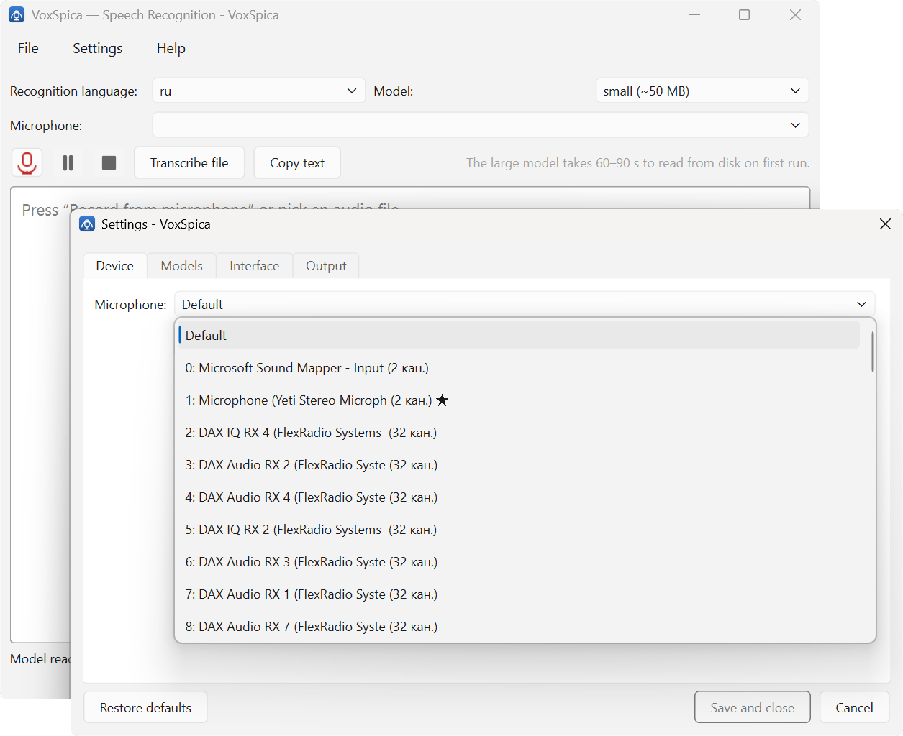
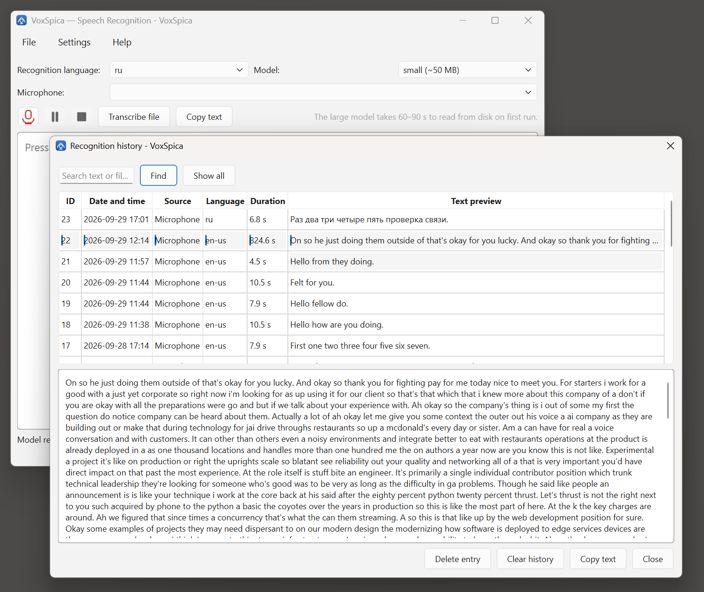

<p align="center">
  
</p>

<h1 align="center">VoxSpica</h1>

<p align="center">
  <b>Dettatura e trascrizione vocale per Windows che non invia la tua voce da nessuna parte.</b><br>
  <sub>La voce resta sul tuo computer. Nessun account, nessun abbonamento, nessun cloud.</sub>
</p>

<p align="center">
  <a href="https://github.com/alex37529/voxspica/releases"></a>
  <a href="docs/USER-GUIDE.md"></a>
  <a href="https://voxspica.4crytobot.xyz"></a>
</p>

<p align="center">
  
  
  
  
  
</p>

<p align="center">
  <sub><a href="README.md">English</a> · <a href="README.de.md">Deutsch</a> · <a href="README.es.md">Español</a> · <a href="README.fr.md">Français</a> · <a href="README.it.md">Italiano</a> · <a href="README.ru.md">Русский</a> · <a href="README.zh.md">简体中文</a></sub>
</p>

---

## Che cos'è

VoxSpica trasforma la voce in testo su Windows e nulla lascia il computer. Il
motore di riconoscimento è [VOSK](https://alphacephei.com/vosk/), una build
desktop di Kaldi con codice aperto, che gira sulla tua CPU. Nessuna GPU, nessuna
rete, nessuna telemetria.

Funziona in due modi:

- **Dettatura dal vivo** dal microfono, con il testo che compare mentre parli.
- **Trascrizione di file** per qualsiasi cosa il sistema sappia riprodurre:
  mp3, m4a, wav e altri se hai [ffmpeg](https://ffmpeg.org/) nel percorso.

Ogni riconoscimento viene salvato in un database locale che puoi cercare.

## Perché offline

I servizi di dettatura che potresti aver usato inviano il tuo audio al server di
qualcun altro. Per loro è una scelta ragionevole, per uno strumento il cui
compito è annotare quello che hai appena detto ad alta voce è una scelta
peggiore: di solito si tratta di un documento riservato, del nome di un cliente
o di un pensiero che non hai ancora deciso di pubblicare.

Qui la risposta è strutturale, non promessa: il modello è sul tuo disco, il
database è sul tuo disco e nel programma non esiste un solo punto che apra una
connessione.

<p align="center">
  
  <br>
  <sub>L'interfaccia parla nove lingue, ognuna indicata nella propria lingua.</sub>
</p>

## Le schermate

<table>
<tr>
<td width="50%" align="center" valign="top">
  <br>
  <sub><b>Modelli</b> — ogni lingua, le sue dimensioni e quanto costa scaricarla.</sub>
</td>
<td width="50%" align="center" valign="top">
  <br>
  <sub><b>Dispositivo</b> — scegli il microfono, con la sua frequenza di campionamento reale.</sub>
</td>
</tr>
<tr>
<td width="50%" align="center" valign="top">
  <br>
  <sub><b>Cronologia</b> — ogni riconoscimento, cercabile, eliminabile, copiabile.</sub>
</td>
<td width="50%" align="center" valign="top">
  <br>
  <sub><b>Interfaccia</b> — cambia lingua quando vuoi.</sub>
</td>
</tr>
</table>

## Come ottenerlo

<table>
<tr>
<th align="left" width="50%">Installer per lingua</th>
<th align="left" width="50%">Archivio portatile</th>
</tr>
<tr>
<td valign="top">

Sette installer, uno per lingua dell'interfaccia. Ognuno porta con sé un modello
di riconoscimento già pronto per quella lingua, così il primo avvio funziona
senza rete. Scegli la tua — i link sono qui sotto.

</td>
<td valign="top">

Un solo <code>VoxSpica.exe</code> dentro uno zip. Non si installa nulla, non si
scrive nulla nel sistema e la cartella può stare su una chiavetta. Scegli la
lingua dell'interfaccia al primo avvio e scarica un modello in quel momento.

Le build portatili sono in [Releases](https://github.com/alex37529/voxspica/releases).

</td>
</tr>
</table>

### Scoop

Se usi già [Scoop](https://scoop.sh):

```powershell
scoop bucket add voxspica https://github.com/alex37529/voxspica-scoop
scoop install voxspica
```

Installa l'archivio portatile e mette `voxspica` nel PATH. Il manifest legge
il checksum dal `SHA256SUMS.txt` della release, così `scoop update` prende da
solo le versioni nuove.

### I sette installer

Indirizzo base: <https://voxspica.4crytobot.xyz/downloads>

-  <a href="https://voxspica.4crytobot.xyz/downloads/VoxSpica-0.1.5-en-setup.exe"><code>VoxSpica-0.1.5-en-setup.exe</code></a> — English, 106.4 MB
-  <a href="https://voxspica.4crytobot.xyz/downloads/VoxSpica-0.1.5-ru-setup.exe"><code>VoxSpica-0.1.5-ru-setup.exe</code></a> — Русский, 111.3 MB
-  <a href="https://voxspica.4crytobot.xyz/downloads/VoxSpica-0.1.5-de-setup.exe"><code>VoxSpica-0.1.5-de-setup.exe</code></a> — Deutsch, 111.3 MB
-  <a href="https://voxspica.4crytobot.xyz/downloads/VoxSpica-0.1.5-fr-setup.exe"><code>VoxSpica-0.1.5-fr-setup.exe</code></a> — Français, 107.6 MB
-  <a href="https://voxspica.4crytobot.xyz/downloads/VoxSpica-0.1.5-es-setup.exe"><code>VoxSpica-0.1.5-es-setup.exe</code></a> — Español, 104.9 MB
-  <a href="https://voxspica.4crytobot.xyz/downloads/VoxSpica-0.1.5-it-setup.exe"><code>VoxSpica-0.1.5-it-setup.exe</code></a> — Italiano, 114.7 MB
-  <a href="https://voxspica.4crytobot.xyz/downloads/VoxSpica-0.1.5-zh-setup.exe"><code>VoxSpica-0.1.5-zh-setup.exe</code></a> — 简体中文, 109.1 MB

L'elenco indica una versione e viene sostituito a ogni uscita nuova. L'archivio
portatile non è qui di proposito: sta nel release, ed è quello giusto se ti
serve una lingua dell'interfaccia che non è in elenco. Le bandierine arrivano da
[flagcdn.com](https://flagcdn.com) e indicano la lingua, non la nazione:
l'inglese è 🇬🇧 e non 🇺🇸 perché l'interfaccia si chiama `en` e non `en-US`, e
nessun installer porta con sé un'interfaccia americana. Se flagcdn non è
raggiungibile i link funzionano lo stesso, spariscono solo le immagini.

> **Windows ti avviserà.** Le build non sono firmate, quindi SmartScreen segnala
> un editore sconosciuto. Clicca *Ulteriori informazioni* → *Esegui comunque*.
> Vedi [cosa non fa](#cosa-non-fa): la firma è in elenco.

## Primo avvio

1. Avvia il programma. Al primo avvio chiede la lingua dell'interfaccia.
2. Scegli la **lingua di riconoscimento**, cioè quella in cui stai per
   *parlare*. È diversa dalla lingua dell'interfaccia e non dipende da essa.
3. Scarica un modello. Quello **piccolo** è circa 50 MB e basta per le bozze;
   quello **grande** è più preciso, richiede circa 8 GB di RAM e al primo avvio
   della sessione impiega 60–90 secondi a caricarsi.
4. Scegli un microfono, premi registra e parla.

La [guida](docs/USER-GUIDE.md) passa ogni schermata una per una, cosa fare
quando manca un modello e come differiscono i modelli piccoli da quelli grandi.

## Lingue

L'**interfaccia** è disponibile in nove lingue: bielorusso, tedesco, inglese,
spagnolo, francese, italiano, russo, ucraino, cinese semplificato.

Il **riconoscimento** funziona in 33 lingue, elencate con i nomi dei modelli in
[docs/LANGUAGES.md](docs/LANGUAGES.md). Riconoscimento e interfaccia sono
indipendenti: puoi dettare in ucraino con un'interfaccia inglese.

## Riga di comando

Il programma non è solo una finestra. Tutto quello che fa è disponibile da
console, che è ciò che serve in uno script o in un programma con tasti di scelta
rapida:

```powershell
VoxSpica.exe mic --lang it --size small      # dettatura, testo su stdout
VoxSpica.exe file meeting.mp3 --lang en-us   # trascrive un file
VoxSpica.exe devices                         # elenca i microfoni
VoxSpica.exe download --lang it --size small
VoxSpica.exe list                            # lingue e i loro modelli
VoxSpica.exe history --search "riunione"     # cosa è stato riconosciuto
```

## Cosa non fa

Detto chiaramente, perché è la parte che di solito si scopre dopo.

- **Non è firmato.** Windows mostra un avviso SmartScreen a ogni installazione.
- **Niente virgole.** VOSK restituisce parole senza punteggiatura. VoxSpica
  ricostruisce le maiuscole e mette il punto a fine frase, ma non può collocare
  le virgole senza analizzare la sintassi: qualsiasi regola semplice produce
  «Come, stai?» invece di «Come stai?».
- **Solo Windows x64.** Non esistono build per macOS e Linux.
- **I modelli sono separati.** Fuori dagli installer per lingua, nessun file
  contiene un modello, e vanno da 50 MB a 1,8 GB. Gli installer per lingua sono
  l'eccezione: ne portano uno ciascuno.

## Informazioni su questo repository

Qui ci sono **solo le release**. Il codice sorgente non è pubblico e non viene
rispecchiato — in questo repository non c'è nemmeno un pezzo. I tag `vX.Y.Z`
puntano al piccolo commit pubblico che introduce questo file, non al codice
dell'applicazione. I file allegati a ogni release sono binari compilati.

Sito: <https://voxspica.4crytobot.xyz>

## Licenza

Proprietaria, uso gratuito, vedi [LICENSE](LICENSE). Il riconoscimento è fatto da
[VOSK](https://alphacephei.com/vosk/) (Apache-2.0); i modelli di riconoscimento
sono distribuiti da Alpha Cephei anch'essi con licenza Apache-2.0.
