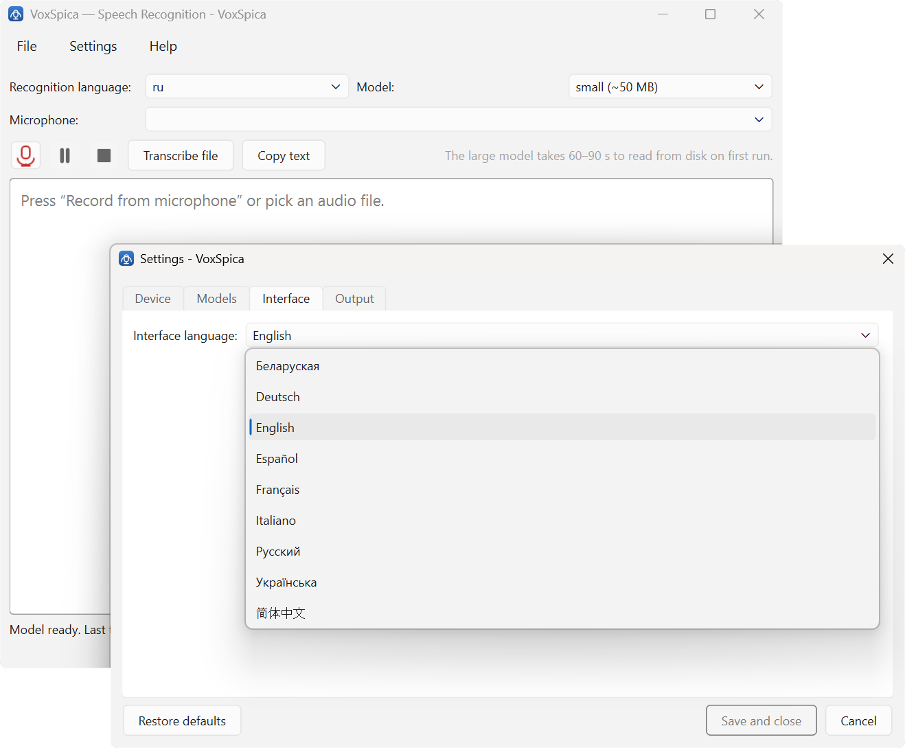

# Guía de usuario

<p align="center">
  <sub>[English](USER-GUIDE.md) · [Deutsch](USER-GUIDE.de.md) · [Français](USER-GUIDE.fr.md) · [Italiano](USER-GUIDE.it.md) · [Русский](USER-GUIDE.ru.md)</sub>
</p>

VoxSpica reconoce voz en Windows sin enviar el audio a ninguna parte. Esta guía
recorre las pantallas en el orden en que las encontrarás.

- [Instalación](#instalación)
- [La ventana principal](#la-ventana-principal)
- [Elegir el idioma de reconocimiento](#elegir-el-idioma-de-reconocimiento)
- [Descargar un modelo](#descargar-un-modelo)
- [¿Pequeño o grande?](#pequeño-o-grande)
- [Elegir micrófono](#elegir-micrófono)
- [Dictar](#dictar)
- [Transcribir un archivo](#transcribir-un-archivo)
- [Historial](#historial)
- [Cambiar el idioma de la interfaz](#cambiar-el-idioma-de-la-interfaz)
- [Línea de órdenes](#línea-de-órdenes)
- [Cuando algo no funciona](#cuando-algo-no-funciona)

---

## Instalación

Hay dos maneras, y la diferencia importa si te importa el primer arranque.

**El instalador por idioma** instala el programa en «Programas» y deja junto a
él un modelo de reconocimiento para ese idioma. Hay siete, uno por idioma de
interfaz: inglés, ruso, alemán, francés, español, italiano y chino. Como el
modelo ya está ahí, el primer arranque no necesita internet.

**El archivo portátil** es un único `VoxSpica.exe` dentro de un zip. No se
instala nada, no se escribe nada en el sistema y la carpeta puede vivir en una
memoria USB. El precio es el primer arranque: el programa pregunta el idioma de
la interfaz y luego descarga un modelo, así que hace falta red una vez.

> **Windows te avisará.** Las compilaciones no están firmadas. SmartScreen
> señala un editor desconocido, que tiene el mismo aspecto que el software
> malicioso. Pulsa *Más información* → *Ejecutar de todas formas*.

## La ventana principal

Todo vive en una ventana, con tres pantallas de ajustes detrás del menú
`Settings`.

| Control | Qué hace |
| --- | --- |
| **Recognition language** | El idioma en el que vas a *hablar*. Ver más abajo. |
| **Model** | Qué tamaño de modelo: pequeño o grande. |
| **Microphone** | Desde qué dispositivo se graba. |
| ● / ❙❙ / ■ | Grabar, pausar, detener. |
| **Transcribe file** | Elegir un archivo de audio y reconocerlo. |
| **Copy text** | Poner el texto reconocido en el portapapeles. |
| Línea de estado | Qué está haciendo el programa y cuánto tardó la última carga. |

La línea de estado avisa cuándo el modelo está listo. Si grabas antes de que
diga `Model ready`, el programa esperará.

## Elegir el idioma de reconocimiento

**Idioma de reconocimiento e idioma de interfaz son dos ajustes distintos.**

El idioma de *reconocimiento* es aquel en el que hablas; decide qué modelo hay
que cargar. El idioma de *interfaz* es aquel en el que están escritos los
botones. Nada los ata: puedes dictar en ucraniano con una interfaz en inglés, y
el instalador hace lo mismo.

El idioma se elige por su código VOSK, no por un país. `en-us` y `en-in` son
inglés para acentos distintos, `el-gr` es griego, `cn` es mandarín, `uk` es
ucraniano.

Los 33 códigos con sus modelos están en [LANGUAGES.md](LANGUAGES.md).

## Descargar un modelo

Los modelos no forman parte del programa. Se descargan una vez, se guardan junto
a la aplicación y se pueden borrar cuando quieras.

Abre `Settings` → **Models**. La columna izquierda lista cada idioma del
registro y los tamaños que existen para él. Al seleccionar uno, a la derecha se
ve lo que cuesta:

- una tarjeta del modelo **pequeño** con su tamaño en disco, y los botones
  **Delete** y **Warm up in memory**;
- una tarjeta del modelo **grande**, con un botón **Download**.

Hay idiomas que solo tienen un tamaño: el registro no tiene `small` para árabe,
portugués brasileño, griego y filipino, ni `large` para catalán, checo, estonio,
coreano, polaco, sueco, telugu, turco y uzbeco. La pestaña lo dice en lugar de
ofrecer una descarga que fallaría.

Los modelos se cargan en segundo plano al arrancar, así que la grabación
empieza en cuanto el modelo está caliente.

## ¿Pequeño o grande?

| | pequeño | grande |
| --- | --- | --- |
| Tamaño en disco | unos 50 MB | unos 1,8 GB |
| Carga | segundos | 60–90 s la primera vez |
| Memoria | unos cientos de MB | alrededor de 8 GB |
| Precisión | suficiente para borradores | notablemente mejor |

La ventana principal lleva una nota sobre el tiempo de carga, porque es la
parte que sorprende: el modelo grande no tarda solo más, lee minuto y medio
desde el disco en el primer arranque de una sesión.

**Empieza con el pequeño.** Pasa al grande cuando necesites una transcripción
que se vaya a citar: una entrevista, una cita, un nombre que no puedes adivinar.

## Elegir micrófono

`Settings` → **Device** lista todas las entradas que declara el sistema, con
índice, nombre y frecuencia de muestreo. *Default* es la entrada por defecto del
sistema; un asterisco marca los dispositivos que el sistema considera
predeterminados.

Un micrófono a 2 kHz no es una captura real: es un bucle o un punto virtual.
Elige el que tenga una frecuencia que te suene, normalmente 16 kHz o
44,1/48 kHz.

## Dictar

1. Comprueba que la línea de estado dice que el modelo está listo.
2. Elige el micrófono.
3. Pulsa el botón de grabar o el icono de micrófono de la barra.
4. Habla. El texto aparece según hablas.
5. Pulsa detener. Pausa cuando tengas que pensar.
6. **Copy text** pone el resultado en el portapapeles.

Las transcripciones se escriben junto al programa, y cada reconocimiento se
añade al historial.

## Transcribir un archivo

**Transcribe file** abre un selector. El programa lee WAV de forma nativa; para
mp3, m4a, ogg y parecidos hace falta
[ffmpeg](https://ffmpeg.org/download.html) en el `PATH` — en Windows basta con
`winget install Gyan.FFmpeg`.

El archivo se reconoce en una pasada, que para la mayoría de las grabaciones es
más rápido que en tiempo real.

## Historial

Cada reconocimiento se guarda localmente en SQLite y aparece en la ventana de
historial.

La tabla muestra el identificador, la fecha y la hora, el origen (micrófono o
archivo), el idioma, la duración del audio y un adelanto del texto. El campo de
búsqueda filtra por el texto; **Find** aplica el filtro y **Show all** lo
quita.

Una fila seleccionada muestra abajo el texto completo. Desde ahí puedes pulsar
**Copy text**, **Delete entry** o **Clear history** para borrarlo todo de una
vez.

El historial es un archivo SQLite normal en el perfil del usuario. No se sube
nada, y borrar el archivo borra el historial.

## Cambiar el idioma de la interfaz

`Settings` → **Interface**. Nueve idiomas, cada uno nombrado en el suyo:
Беларуская, Deutsch, English, Español, Français, Italiano, Русский, Українська,
简体中文.

La elección surte efecto de inmediato. En el primer arranque de una versión
portátil aparece el mismo diálogo antes que nada.



## Línea de órdenes

El ejecutable también funciona desde la consola, y así es como se usa en un
script o en un lanzador de atajos:

```powershell
VoxSpica.exe mic --lang es --size small       # dictar, texto a stdout
VoxSpica.exe file meeting.mp3 --lang en-us    # transcribe un archivo
VoxSpica.exe devices                          # listar los dispositivos de entrada
VoxSpica.exe list                             # idiomas y sus modelos
VoxSpica.exe download --lang es --size small  # descargar un modelo
VoxSpica.exe history --search "reunión"       # buscar entre los anteriores
VoxSpica.exe history show 3                   # una entrada completa
VoxSpica.exe config lang=fr size=large        # recordar una elección
```

Interruptores útiles en los comandos de grabación:

| Interruptor | Efecto |
| --- | --- |
| `--no-punct` | Exactamente lo que dijo VOSK: sin mayúsculas ni punto |
| `--no-history` | No guardar el resultado en el historial |
| `-o ARCHIVO` | Escribir a un archivo en vez de a stdout |
| `--device N` | Usar un micrófono concreto por su índice |

Los ajustes siguen una regla: valores integrados, luego los del instalador,
luego tu archivo, luego la línea de órdenes. Así que un `--lang en-us` puntual
no cambia lo que usará la ventana la próxima vez.

## Cuando algo no funciona

**«Model required» al arrancar.** El programa busca un modelo en el idioma que
indican tus ajustes y no lo encuentra. Dos causas:

- los ajustes nombran un idioma de una instalación anterior, cuyo modelo se fue
  con ella — elige en `Settings` → **Models** el idioma que realmente tienes;
- el modelo está, pero del otro tamaño — comprueba que **Model** en la ventana
  principal coincide con lo instalado.

**SmartScreen bloquea el instalador.** Normal: las compilaciones no están
firmadas. *Más información* → *Ejecutar de todas formas*.

**No hay comas en el texto.** Normal, mira el README. VOSK no produce puntuación
y reconstruirla sin un modelo de lenguaje da un resultado peor que no hacer
nada.

**«No se puede abrir en escritura el archivo existente».** Los modelos y las
transcriptions viven junto al programa. Bajo `C:\Program Files` un usuario normal
no puede escribir, así que el programa pasa a `%LOCALAPPDATA%\VoxSpica` y lo
dice.

**No arrancan dos copias.** La segunda ve la primera y se niega. Es a
propósito: dos copias se estorbarían en el archivo de ajustes, la base de datos
del historial y el directorio de modelos. Cierra la primera, o define
`VOXSPICA_NO_SINGLE_INSTANCE=1`.

**Un modelo se descarga y desaparece.** Una descarga que no pasa la comprobación
de integridad se borra en lugar de quedarse a medias. Descárgalo otra vez; si se
repite, la red está cortando la transferencia.

---

## Ver también

- [LANGUAGES.md](LANGUAGES.md) — los 33 idiomas de reconocimiento y sus modelos
- [Guía en francés](USER-GUIDE.fr.md) · [Русский README](../README.ru.md) · [English](../README.md)
- <https://voxspica.4crytobot.xyz> — el sitio web
